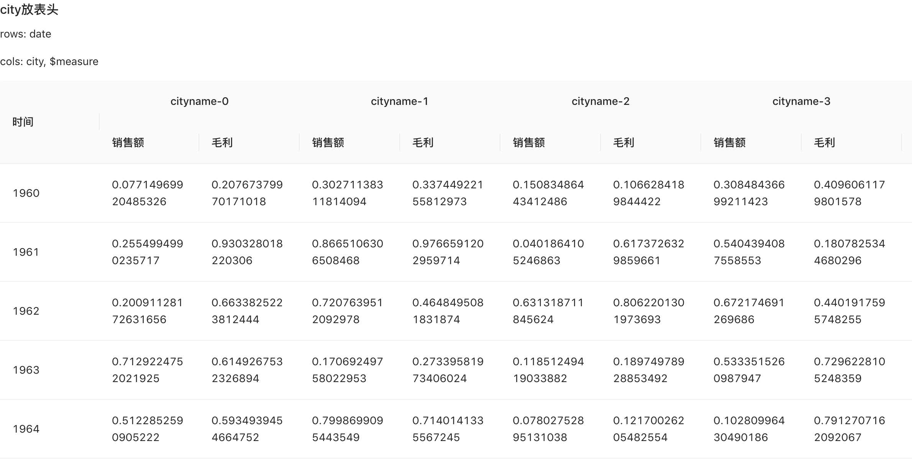

# 通用交叉表数据解析器

## 示例
```js
const data2 = pivotTableData({
    dimensionsConfig: [
      {
        dataIndex: 'city',
        title: '城市',
      },
      {
        dataIndex: 'date',
        title: '时间',
      },
    ],
    measuresConfig: [
      {
        dataIndex: 'index_0',
        title: '销售额',
      },
      {
        dataIndex: 'index_1',
        title: '毛利',
      },
    ],
    dataSource: testData,
    rows: [ 'date','city'],
    cols: ['$measure']
  })


  const app2 = <Table 
    tableLayout="fixed"
    scroll={{x: '100%'}}
    columns={data2.columns}
    dataSource={data2.dataSource}
  />

```

